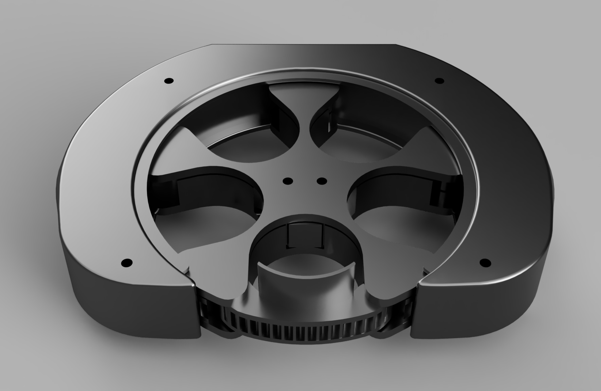

# Барабанний Скид для FPV

## Огляд

Цей проект призначений для скидання до 5 предметів за допомогою барабанного механізму, який може бути встановлений на дрон. Управління відбувається за допомогою сервоприводів, що контролюють обертання барабана та відкривання/закривання отворів для скидання предметів.

## Матеріали

### Основні компоненти:

- Корпус барабанного скиду
- Барабан з отворами для скидання предметів
- Сервоприводи MG-90 360 (без стопера)
- Магніти d=4mm, h=8mm
- Arduino Nano для управління

### Кріплення:

- Винти M3x8
- Винти М1.4×4 для Arduino

### Електроніка:

- Датчики Холла SS49E для контролю положення барабана
- Шлейфи 3-жильні для підключення

## Інструкції з друку

- Матеріал: PETG
- Заповнення: 20%
- Підтримка: не потрібна

## Прошивка для Arduino Nano

1. Завантажте [Arduino IDE](https://www.arduino.cc/en/software) або [PlatformIO](https://platformio.org/platformio-ide).
2. Відкрийте файл прошивки `firmware.ino`.
3. Підключіть Arduino Nano до комп'ютера через USB.
4. Оберіть правильний порт і тип плати.
5. Завантажте прошивку на плату.

## Підключення

### Сервоприводи:

- Підключіть сервоприводи до виходів на Arduino Nano відповідно до схеми.

### Датчики Холла:

- Підключіть датчики Холла для моніторингу положення барабана.

## Примітки

- Переконайтеся, що плата Arduino правильно підключена до комп'ютера.
- У разі проблем із завантаженням можливо, буде потрібно натиснути кнопку скидання на платі.

## Важлива інформація

Проект було вкрадено, тому тепер доступи до матеріалів надаються лише за запитом. Звертайтеся для отримання необхідних файлів.

---

Цей Редми містить необхідну інформацію для складання та програмування барабанного скиду для FPV-дронів.
