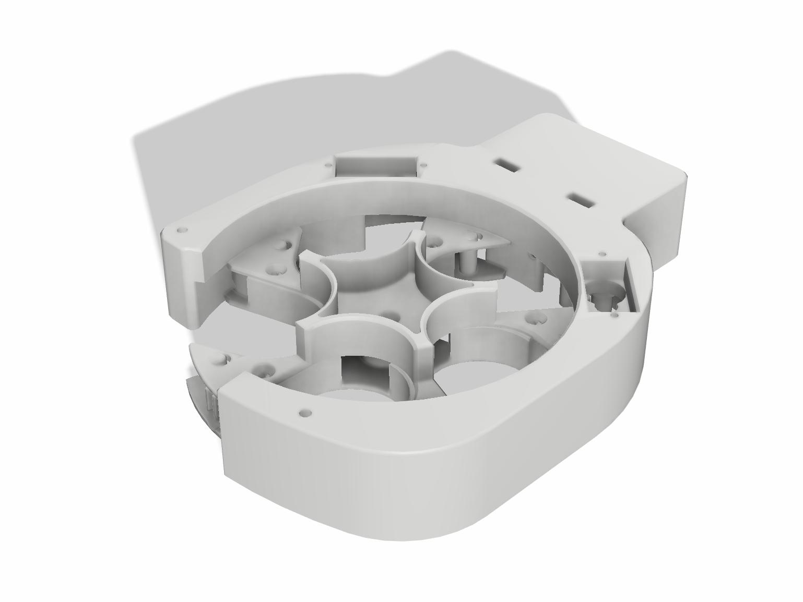

# Барабанний Скид для FPV

## Огляд

Цей проект є барабанним скидом для FPV, розробленим для скидання 5 предметів. Він може бути монтований на дрон і управляється за допомогою сервопривода. Сам скид складається з двох основних частин: корпусу та барабану. Корпус закріплюється на дроні, тоді як барабан обертається всередині корпусу. В барабані є отвори, через які можуть випадати предмети. Сервопривід забезпечує обертання барабана та відкривання/закривання отворів.

## Інструкції зі збірки

### Налаштування друку

- Підтримка: Відсутня
- Стінки: 4 шари
- Заповнення: 20%
- Верхні/нижні стінки: 4 шари
- Матеріал: PETG

### Матеріали

- (1) Деталь верхня кришка корпусу
- (1) Деталь нижня кришка корпусу
- (1) Деталь верхня частина барабану
- (1) Деталь нижня частина барабану
- (1) Деталь кріплення
- (2) Деталь зубчасте колесо
- (5) Деталь створки
- (5) Деталь виталки
- (4) Винти М3х10 для кріплення до корпусу барабану
- (2) Винти М3х20 для затискання барабану
- (4) Винти М3×25 для затискання корпусу

### Електроніка

- (2) Сервоприводи SG-90
- (5) Пружини d5мм
- (1) Перехідник для сервоприводів
- (1) Arduino Nano, ESP32 з аналоговими виходами, STM32 

## Інструкції з прошивки

Цей документ містить інструкції з прошивки для трьох різних платформ: ESP32, Arduino та STM32. Перед початком переконайтесь, що у вас встановлене середовище розробки, яке підтримує вашу цільову платформу.

### Загальні вимоги

- Встановлене середовище [Arduino IDE](https://www.arduino.cc/en/software) або [PlatformIO](https://platformio.org/platformio-ide) для Arduino та ESP32.
- Для STM32: [STM32CubeIDE](https://www.st.com/en/development-tools/stm32cubeide.html) або Arduino IDE з встановленим плагіном STM32duino.
- USB-кабель для підключення плати до комп'ютера.
- Драйвери для вашої плати, якщо вони потрібні.

### Прошивка для Arduino

1. Відкрийте Arduino IDE.
2. Виберіть `Файл` > `Відкрити...` та знайдіть файл `firmware.ino` у папці `arduino`.
3. Підключіть вашу п

лату Arduino до комп'ютера через USB.
4. Виберіть тип плати та порт у `Інструменти`.
5. Натисніть `Завантажити` для прошивки плати.

### Прошивка для ESP32

1. Встановіть підтримку ESP32 в Arduino IDE через `Інструменти` > `Плата` > `Менеджер плат` > пошук `ESP32` та встановлення.
2. Відкрийте файл `firmware.ino` з папки `esp32`.
3. Підключіть вашу плату ESP32 до комп'ютера.
4. В Arduino IDE виберіть вашу плату ESP32 у `Інструменти` > `Плата` та відповідний COM-порт.
5. Завантажте прошивку, натиснувши `Завантажити`.

### Прошивка для STM32

1. Якщо використовуєте Arduino IDE, встановіть підтримку STM32 через `Інструменти` > `Плата` > `Менеджер плат`. Знайдіть та встановіть "STM32 Cores" від STMicroelectronics.
2. Відкрийте `firmware.ino` з папки `stm32`.
3. Підключіть плату STM32 до комп'ютера через USB.
4. В Arduino IDE виберіть вашу плату STM32 у `Інструменти` > `Плата` та вкажіть COM-порт.
5. Для завантаження на плату натисніть `Завантажити`.

## Підключення

Для підключення сервоприводів MG90 до Arduino Nano/ESP32/STM32 відповідно до наданого коду, ви маєте виконати наступні кроки:

1. **Підключення сервоприводів**: У вас є два сервоприводи (myservo1 та myservo2), які потрібно підключити до пінів Arduino Nano. Для myservo1 використовуйте пін 5, а для myservo2 - пін 6. У сервоприводів MG90 зазвичай є три дроти: живлення (червоний), земля (чорний або коричневий) та сигнал (помаранчевий, жовтий або білий). Підключіть червоні дроти до 5V на Arduino, чорні або коричневі до GND, а помаранчеві, жовті або білі дроти до відповідних сигнальних пінів (5 та 6).

2. **Підключення аналогового входу**: У коді використовується аналоговий пін A4 для читання аналогового значення, яке потім порівнюється з пороговим значенням. Підключіть датчик або пристрій, який ви хочете використовувати для керування сервоприводами, до піну A4. Переконайтеся, що вихід датчика адаптований для роботи з аналоговим входом Arduino (0-5V).

3. **Електроживлення**: Arduino Nano може живити сервоприводи безпосередньо з пінів 5V та GND, але якщо ваші сервоприводи споживають багато струму або якщо ви використовуєте більше одного сервопривода, рекомендується використовувати зовнішнє джерело живлення для сервоприводів, щоб уникнути перевантаження регулятора напруги на Arduino. У такому випадку обов'язково з'єднайте землі зовнішнього джерела живлення та Arduino.

4. **Програмування**: Завантажте наданий код в Arduino Nano за допомогою Arduino IDE. Цей код керує позиціями сервоприводів в залежності від прочитаних аналогових значень, порівнюючи їх з пороговим значенням.

5. **Тестування**: Після підключення та програмування перевірте систему, подаючи різні аналогові значення на пін A4 та спостерігаючи за реакцією сервоприводів. Переконайтеся, що сервоприводи рухаються відповідно до заданих у коді позицій при перевищенні порогового значення.

## Примітки

- Переконайтесь, що вибраний правильний COM-порт для вашої плати перед завантаженням.
- У деяких випадках може бути потрібно натиснути та утримувати кнопку BOOT на платі перед завантаженням або скинути плату безпосередньо після початку завантаження.

Якщо у вас виникають проблеми з підключенням або прошивкою, зверніться до офіційної документації вашої платформи.